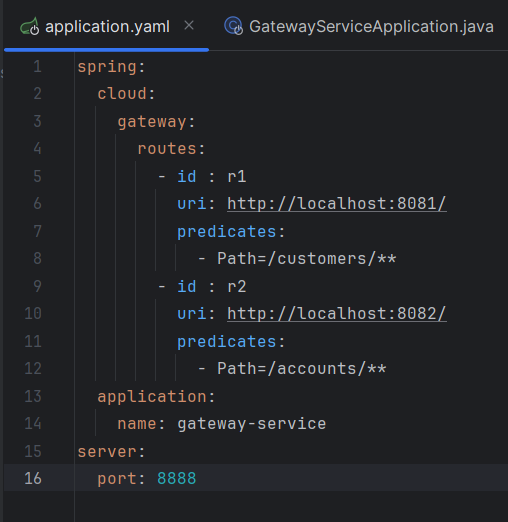
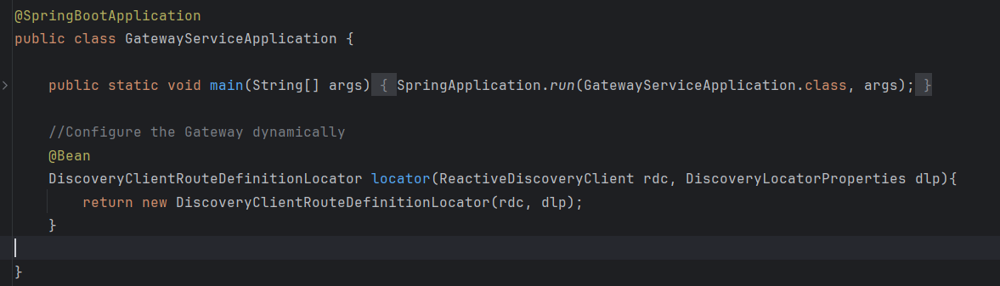
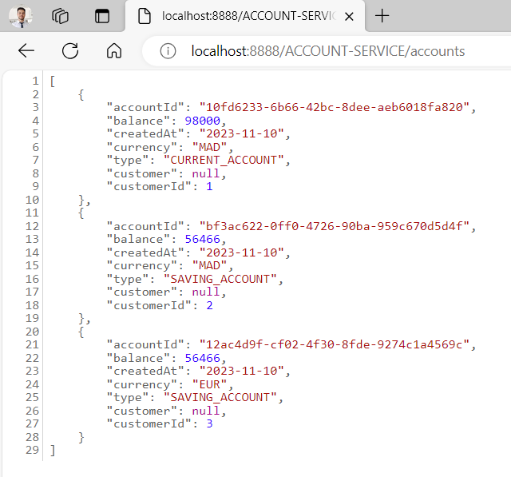
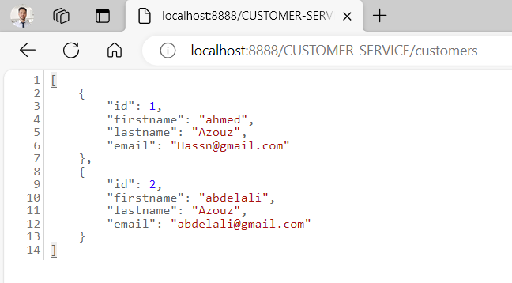

# banck-account-app
Développement d'une app microservices pour entrainement

### Swagger
On utilise Swagger pour la documentation des endpoints (api) des MS
par exemple :  
http://localhost:8082/swagger-ui/index.html : CUSTOMER-SERVICE  
http://localhost:8081/swagger-ui/index.html : ACCOUNT-SERVICE

### Discovery service (Spring Eureka)
Afficher les instances des microservices qui sont démarré  
pour l'implémenter il faut tout simplement ajouter l'annotation : **@EnableEurekaServer** et le **server.port**
http://localhost:8761/

### Gateway 
Il y a deux façons pour configurer la Gateway :
1) **méthode statique** : avec un fichier _properties.yaml_ qui contient la configuration des routes manuellement : 

2) **méthode dynamique** : 
à travers la classe DiscoveryClientRouteDefinitionLocator : 

maintenant on peut accéder aux microservices juste à travers la Gateway avec l'url : gateway-service-ipaddr:{gateway-port}/MS-NAME-MAJ/endpoint  
3) Exemple
MS ACCOUNT-SERVICE :

MS CUSTOMER-SERVICE :   

